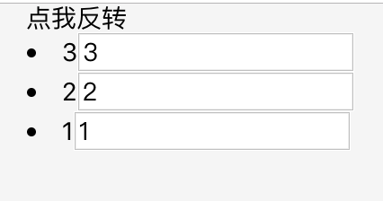

### 一些面试记录

1. `react` 为什么不推荐使用数组的 `index` 作为索引?
    ```
    import React from 'react';

    export default class Msg extends React.Component {
      state = {
        data: [
          {
            id: 1,
            name: '1',
          },
          {
            id: 2,
            name: '2',
          },
          {
            id: 3,
            name: '3',
          },
        ],
      };

      handleClickReverse = () => {
        const { data } = this.state;
        const newData = data.reverse();
        this.setState({
          data: newData,
        });
      };

      render() {
        return (
          <div>
            <div onClick={this.handleClickReverse}>点我反转</div>
            {this.state.data.map((item, index) => {
              return (
                <Item key={index} val={item.name} />
              );
            })}
          </div>
        );
      }
    }

    class Item extends React.Component {
      componentWillUpdate(nextProps, nextState) {
        console.log('已更新');
      }

      render() {
        const { val } = this.props;
        return (
          <li>
            <label htmlFor="">{val}</label>
            <input type="text" />
          </li>
        );
      }
    }
    ```
    当我们在 input 框里面一次输入 1，2，3,页面渲染为

    

    当我们将数组反转之后，我们预期页面将变成

    

    然而事实上,页面变成了

    

    为什么会这样呢？当我们以数组的`index`作为索引时，此时的`key`是`0 1 2`,当我们将数组反转之后的`key`依然是`0 1 2`,`react`在进行`diff`比较时,发现只需要更新子节点就可以了，于是只把`label`进行更新，而`input`则没有进行更新

    另外当我们以数组的`index`作为索引时，假设我们删除了数组的第一项，此时的索引长度就比之前减少 `1`，同时数组子项的`key`值减少`1`，`diff`对比将认为整个`dom`树被更改了，大大增加了性能的损耗

2. `react`如何实现路由按需加载？

    一句话概括，按需加载的目的就是为了提高性能，以下是实现方案，原理就是在触发对应的路由时，才去下载对应的路由
    ```
    import React from 'react';

    const Loading = () => {
      return (
        <div>loading...</div>
      )
    }

    class AsyncComponent extends React.Component{
      state = {
        Component: null
      };
      componentDidMount() {
        const { importComponent } = this.props;
        if (importComponent) {
          return importComponent().then(res => {
            this.setState({
              Component: res.default
            })
          })
        }
      }
      render() {
        const { Component } = this.state;
        return Component ? <Component /> : <Loading />
      }
    }

    export function loadable(Component) {
      return props => <AsyncComponent {...props} importComponent={Component} />
    }
    ```
    `react16.6`发布了一个新功能`React.lazy`和新的组件`Suspense`，两者结合也可以实现动态加载的目的，需要注意的地是，`React.lazy`$\color{red}{和}$`Suspense`$\color{red}{尚不可用于服务器端，如果有做服务端渲染的需求，可以使用官方推荐的}$`React Loadable`